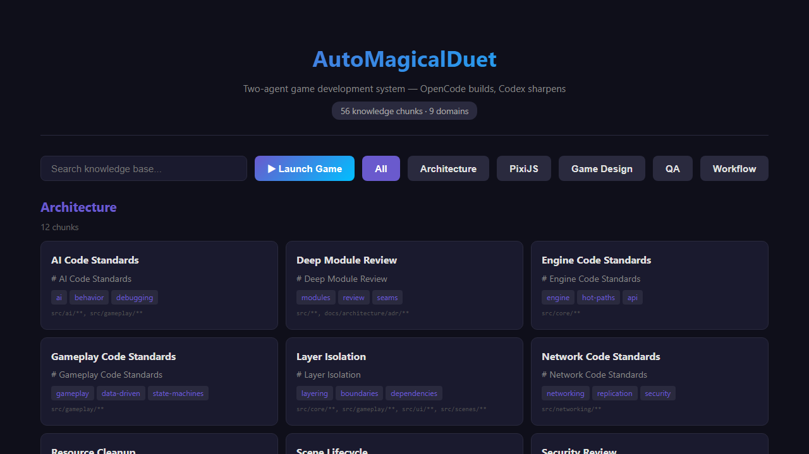

<p align="center">
  
</p>

<h1 align="center">AutoMagicalDuet</h1>
<p align="center">
  <strong>You + two AI agents = your own browser games.</strong>
  <br />
  <em>No experience needed. Just an idea and five minutes.</em>
  <br />
  <br />
  <a href="#-your-first-magic-trick"></a>
  <a href="LICENSE"></a>
  
  
</p>

## ✨ What is this?

**AutoMagicalDuet** is a workshop where you and two AI helpers build browser games together. You describe what you want. One AI builds it. The other AI looks at it and says "hey, this could be better." You play the game in your browser. You change things. Repeat.

It's like having two game developers as friends who never get tired of your ideas.

---

## 🎮 Games you can make

Real games that were built with this system:

<p align="center">
  
  <br />
  <em>A platformer — collect gems, dodge enemies, reach the exit.</em>
</p>

| | | |
|---|---|---|
| **Twin-stick shooter** | **Breakout / Arkanoid** | **Submarine explorer** |
| Survive waves of enemies | Smash bricks, catch power-ups | Dive for treasure, dodge sharks |
| | | |
| **Puzzle game** | **Tic-tac-toe** | **Your idea goes here** |
| Match colors, clear the board | Play against a Cold War AI | **→ You build this one** |

---

## 🪄 Your first magic trick

You have the game running. Let's break it.

Open **`assets/data/gameplay-config.json`** and find this line:

```json
"player_jump_velocity": -500
```

Change the `-500` to `-1200`:

```json
"player_jump_velocity": -1200
```

Save the file. Refresh the game in your browser. Now your character launches into the sky like a rocket.

You just modded a game. In 10 seconds.

> The player config has about 20 knobs you can tweak: speed, health, gravity, jump height, how many gems you need, whether enemies move faster or slower. Try changing them. See what happens. Break things. That's how you learn to make games.

---

## 🗺️ Three paths

Depending on how deep you want to go:

### 🔰 5 minutes — "Change the game"

Tweak numbers in `assets/data/gameplay-config.json`. Make the player faster, the enemy dumber, the gems worth more. You don't need to know code. You just need to change numbers and see what happens.

**What you learn:** Game balance, tuning, cause and effect.

### ⏰ 1 hour — "Make your own level"

Open `assets/data/level-01.json`. This is a list of platforms, gems, enemies, and the exit. You can move things around, add new platforms, put gems in harder places, make the level longer.

Try adding a new enemy:

```json
{ "x": 200, "y": 250, "width": 30, "height": 30, "minX": 150, "maxX": 350, "speed": 80 }
```

**What you learn:** Level design, difficulty curves, placement.

### 🏕️ A weekend — "Invent your own game"

Come up with a game idea and work through it with the AI helpers:

1. **Explore** — "I want to make a fishing game where you catch weird sea creatures"
2. **Frame** — define what the player does, how they win, what's fun about it
3. **Attack** — the critic AI pokes holes in your idea ("what happens if the player does nothing?")
4. **Build** — the builder AI writes the code, you play it, you change it
5. **Prove** — the critic AI checks it in a browser, finds visual bugs, you fix them

**What you learn:** Full game development loop. This is how real games are made — just faster.

---

## 🤖 How the two AI helpers work

Think of them as two friends on your team with clear jobs:

### Who does what

```
OpenCode (the builder)                  Codex (the critic)
─────────────────────────────            ─────────────────────────────
✓ Architecture decisions                ✓ Research & info gathering
✓ ALL coding & implementation           ✓ Design review & critique
✓ Wiring things together                ✓ Visual QA — screenshots, layout
✓ Git & repo management                 ✓ Art generation (sprites, banners)
✓ Final call on disputes                ✓ Browser verification
```

| What needs doing | Who handles it |
|---|---|
| **"Build this feature"** | OpenCode writes the code |
| **"Does this design work?"** | Codex stress-tests it before coding starts |
| **"The jump feels wrong"** | OpenCode tweaks numbers, Codex checks the screenshot |
| **"Make a gem sprite"** | Codex generates via gpt-image-2, OpenCode integrates |
| **"Is the game broken?"** | Codex runs Playwright, inspects the canvas |
| **"Who decides?"** | OpenCode decides on implementation. You decide on the game. |

**You** are the game director. OpenCode builds. Codex sharpens. You decide.

> *OpenCode builds. Codex sharpens. You decide.*

---

## 🧠 The project brain

Every game you build adds knowledge to a shared brain. The brain knows:

- How to design game levels that feel good
- What makes a fun enemy AI
- How to balance difficulty
- PixiJS rendering tricks
- Testing patterns
- Art direction
- Audio design

There are **63 knowledge chunks** across 9 topics. You can browse them at any time.

When you run the game, the landing page is a **knowledge encyclopedia** — a searchable, readable collection of everything the system has learned. Click any topic, read the patterns, steal the ideas.

---

## 🚀 Quick start

```bash
git clone https://github.com/skinnerboxentertainment/AutoMagicalDuet.git
cd AutoMagicalDuet
npm install
npm run dev
```

Open `http://localhost:5173` in your browser.

> The landing page is the encyclopedia. Click **"Launch Game"** to play the platformer. Click any knowledge chunk to read it.

---

## 🧰 What's under the hood

| Layer | What it uses |
|---|---|
| **Game engine** | PixiJS v8 (WebGL / WebGPU / Canvas) |
| **Language** | TypeScript (strict mode — cleaner code) |
| **Build tool** | Vite (instant dev server, fast builds) |
| **Tests** | Vitest (automated testing) |
| **Audio** | Howler.js + jsfxr (retro sound effects) |
| **Skills** | 34 installed AI skills (PixiJS, debugging, Playwright, TDD...) |
| **Knowledge** | 63 chunks across 9 domains, browsable in the encyclopedia |

---

## 📁 Project layout

```
src/                    # Game code
  main.ts               # Entry point
  core/                 # Engine (scenes, input, game loop)
  scenes/               # Game screens (boot, game)
  gameplay/             # Game logic (player, enemies, gems)
  audio/                # Sound system
knowledge/              # The brain (63 chunks, browsable)
production/             # What's happening now and what happened
public/assets/          # Game sprites, banner, screenshots
docs/                   # Architecture decisions and guides
design/                 # Game design documents
tests/                  # Automated tests
```

---

## 📜 License

MIT — do whatever you want with it. Go make games.

<p align="center">
  
  <br />
  <strong>AutoMagicalDuet</strong>
  <br />
  <a href="https://github.com/skinnerboxentertainment/AutoMagicalDuet">GitHub</a>
</p>
