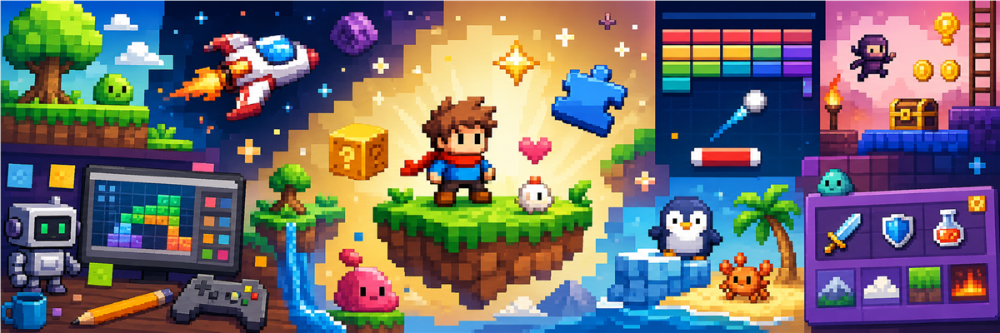

<p align="center">
  
</p>

<h1 align="center">AutoMagicalDuet</h1>
<p align="center">
  <strong>You + two AI agents = your own browser games.</strong>
  <br />
  <em>No experience needed. Just an idea.</em>
  <br />
  <br />
  <a href="#-quick-start"></a>
  <a href="LICENSE"></a>
  
</p>

## What is this?

**AutoMagicalDuet** is a proven, human-directed, multi-agent workflow for building browser games. You describe what you want. OpenCode builds it. Codex critiques it. You play it, change things, and repeat.

This is not a game studio. This is the *system* that runs a game studio — and it has already produced multiple working browser games across several genres.

You are the game director. OpenCode builds and implements. Codex critiques, researches, generates visual assets where appropriate, and verifies in-browser.

---

## Games built with this workflow

The following games were built start-to-finish using the AutoMagical workflow. Each was generated from a text spec, implemented by OpenCode, reviewed by Codex, and validated with automated tests.

| Game | Genre | Tests | Evidence |
|---|---|---|---|
| **Guess the Number** | Number-guessing game | 32 passing | Source in sibling project |
| **WarGames Tic Tac Toe** | Tic-tac-toe w/ minimax AI | 35 passing | Source + screenshots in sibling project |
| **Twin-stick Shooter** | Arcade twin-stick shooter | 44 passing | Source in sibling project |
| **Krakout Clone** | Breakout / Arkanoid | 19 passing | Source in sibling project |
| **Gold Diver** | Submarine treasure diver | 53 passing | Source + sprites in sibling project |
| **OutRun Clone** | Driving / road chase | 14 passing | Source + screenshots in sibling project |
| **Sub Shooter** | Side-scrolling submarine arcade | 35 passing | Git history (replaced by current work) |
| **Platformer** | 2D platformer (gems, enemies, exit) | 20 passing | Git history (replaced by current work) |

Each game has its own project directory with full source code, tests, and assets, following the same template. All use PixiJS v8, TypeScript strict, Vite, and Vitest.

> **Gallery status:** A polished gallery linking these games is planned. For now, a detailed verified inventory is maintained in `production/readme-audit.md`.

---

## How the two AI helpers work

Think of them as two friends on your team with clear jobs:

```
OpenCode (the builder)                  Codex (the critic)
─────────────────────────────            ─────────────────────────────
✓ Architecture decisions                ✓ Research & info gathering
✓ ALL coding & implementation           ✓ Design review & critique
✓ Wiring things together                ✓ Visual QA — screenshots, layout
✓ Git & repo management                 ✓ Art generation (sprites, banners)
✓ Final call on disputes                ✓ Browser verification
```

| What needs doing | Who handles it |
|---|---|
| **"Build this feature"** | OpenCode writes the code |
| **"Does this design work?"** | Codex stress-tests it before coding starts |
| **"The jump feels wrong"** | OpenCode tweaks numbers, Codex checks the screenshot |
| **"Make a sprite"** | Codex generates via gpt-image-2, OpenCode integrates |
| **"Is the game broken?"** | Codex runs Playwright, inspects the canvas |
| **"Who decides?"** | OpenCode decides on implementation. You decide on the game. |

**You** are the game director. OpenCode builds. Codex sharpens. You decide.

> *OpenCode builds. Codex sharpens. You decide.*

> **Want to try OpenCode?** [Start with OpenCode Go](https://opencode.ai/go?ref=H0NH2RZJS1) *(referral link)*.

---

## Try the workflow yourself

### Bring a game idea

Come up with a concept and work through it with the AI helpers:

1. **Explore** — "I want to make a fishing game where you catch weird sea creatures"
2. **Frame** — define what the player does, how they win, what's fun about it
3. **Attack** — the critic AI pokes holes in your idea ("what happens if the player does nothing?")
4. **Build** — the builder AI writes the code, you play it, you change it
5. **Prove** — the critic AI checks it in a browser, finds visual bugs, you fix them

**What you learn:** Full game development loop. This is how real games are made — just faster.

### Fork and run an existing game

Each sibling project in the workspace is a standalone fork. Clone one, run `npm install && npm run dev`, and you have a playable game. Then modify it.

### Dig into the knowledge base

This repo contains a searchable knowledge encyclopedia of patterns, standards, and techniques accumulated across every game built so far. Run `npm run dev` and the landing page is the encyclopedia — browse it, steal the ideas, apply them to your next project.

---

## Quick start

```bash
git clone https://github.com/skinnerboxentertainment/AutoMagicalDuet.git
cd AutoMagicalDuet
npm install
npm run dev
```

Open `http://localhost:5173` in your browser.

> The landing page is the knowledge encyclopedia. Browse 64 knowledge chunks across 9 domains.
>
> **Note on "Launch Game":** The current prototype (ASPECT) is a work-in-progress and may not boot correctly. The strength of this project is the workflow, not any single in-progress prototype. For playable games, see the sibling project directories described above.

---

## What's under the hood

| Layer | What it uses |
|---|---|
| **Game engine** | PixiJS v8 (WebGL / WebGPU / Canvas) |
| **Language** | TypeScript (strict mode) |
| **Build tool** | Vite (instant dev server, fast builds) |
| **Tests** | Vitest (automated testing) |
| **Audio** | Howler.js + jsfxr (retro sound effects) |
| **Skills** | 34 installed AI skills (PixiJS, debugging, Playwright, TDD...) |
| **Knowledge** | 64 chunks across 9 domains, browsable in the encyclopedia |

---

## Project layout

```
src/                    # Game code
  main.ts               # Entry point (boots current prototype)
  core/                 # Engine (scenes, input, game loop)
  aspect/               # Current prototype (ASPECT — work in progress)
knowledge/              # The brain (64 chunks, browsable)
production/             # What's happening now and what happened
public/assets/          # Game sprites, banner, screenshots
docs/                   # Architecture decisions and guides
design/                 # Game design documents (historical)
tests/                  # Automated tests (39 passing)
```

---

## License

MIT — do whatever you want with it. Go make games.

<p align="center">
  
  <br />
  <strong>AutoMagicalDuet</strong>
  <br />
  <a href="https://github.com/skinnerboxentertainment/AutoMagicalDuet">GitHub</a>
</p>
